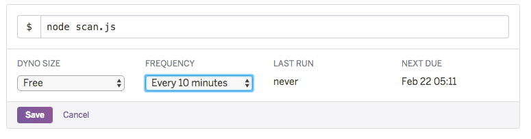

## Combustibles/Expo Notification Server
This simple server built for Heroku registers and stores notification tokens from an Expo app.
It's been made for use with the Combustibles RD app.

### Deploying on Heroku
To deploy your own, click the button below to get started:

[](https://heroku.com/deploy)

Next, you'll want to setup the database. To do this, run the following command while on the project root. Make sure you have the Heroku cli installed and replace [app_name] with the one chosen on deployment.

```
heroku pg:psql --app [app_name] < setup.sql
```

If you want to configure the automatic notifications when there's a price change, setup the preinstalled Scheduler addon with the scan script through the Heroku dashboard. You can access the scheduler's dashboard directly [by clicking here](https://scheduler.heroku.com/dashboard).


